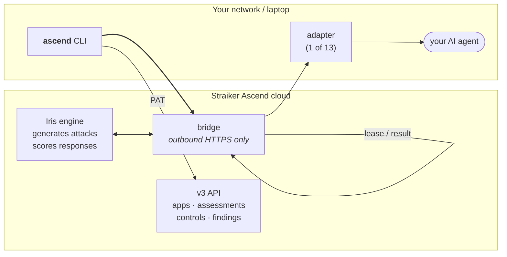
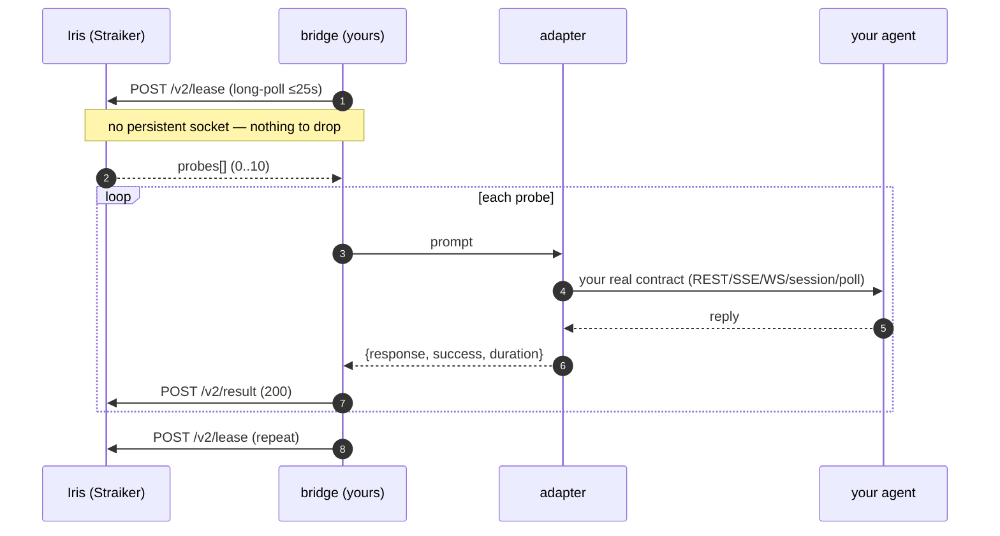
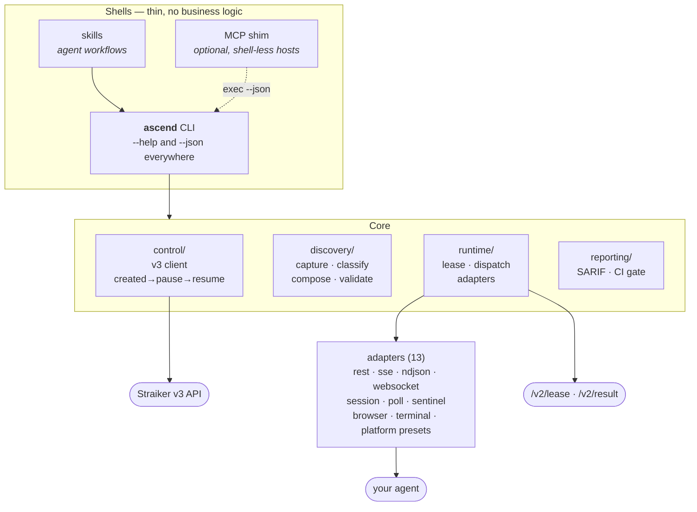
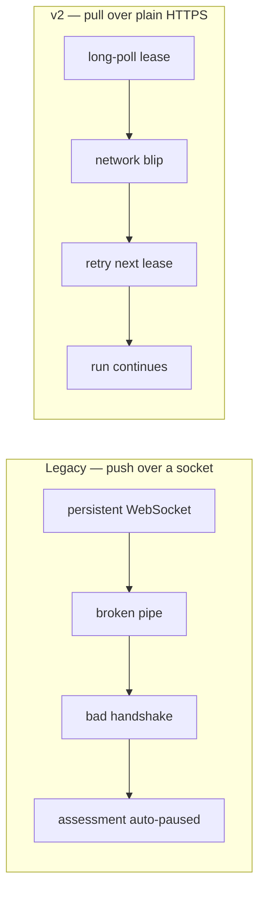
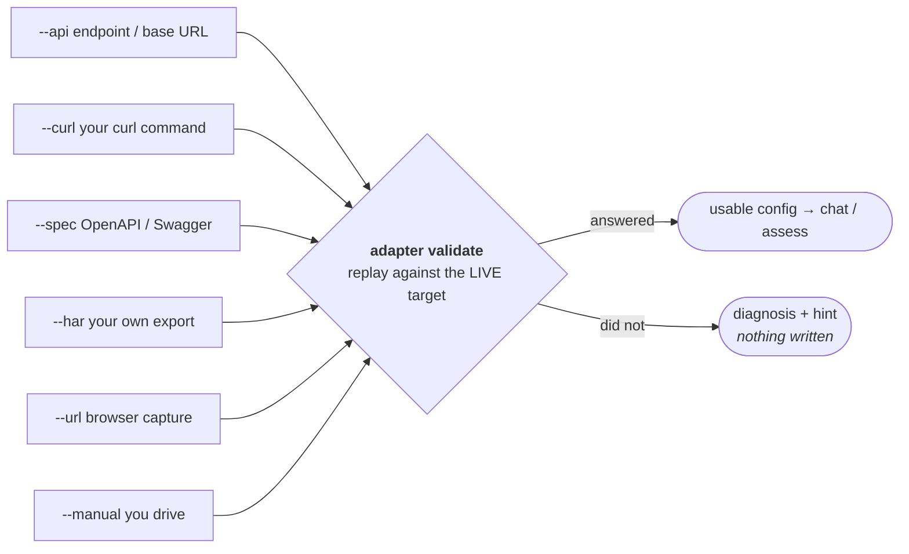

# Architecture

How Ascend CLI connects the Straiker Ascend assessment cloud to your AI agent —
what runs where, what data crosses which boundary, and what you have to operate.

> **Adapter reference:** the per-adapter configuration schemas live in
> [`ADAPTER_AUTHORING.md`](ADAPTER_AUTHORING.md) and the layer model in
> [`CAPABILITY_MATRIX.md`](CAPABILITY_MATRIX.md). For the product documentation on
> advanced adapters, see the Straiker documentation site
> (`https://docs.straiker.ai` → Ascend AI → advanced integrations).

---

## 1. The big picture

Straiker generates and scores the attacks. **You run a small bridge** that fetches
probes over plain HTTPS and delivers them to your agent however your agent expects to
be called. Your agent is never exposed to the internet, and Straiker never needs a
route into your network.

**Boundary facts that matter for review:**

| Question | Answer |
|---|---|
| Does Straiker connect *into* my network? | **No.** The bridge makes **outbound** HTTPS calls only. No inbound firewall rule, no public exposure of the agent. |
| What leaves my network? | The probe prompt (authored by Straiker) and your agent's response, which Straiker scores. |
| Where do my credentials live? | Target credentials stay in your adapter config / environment and are used only by the bridge. Straiker never receives them. |
| Can I stop it instantly? | Yes — stopping the bridge stops delivery immediately. |
| What if the bridge dies mid-probe? | The probe is reclaimed server-side after ~90s and redelivered. Nothing is lost. |

---

## 2. The probe lifecycle

Failures are **submitted, never dropped** — a target error becomes an honest result, so
the assessment completes instead of hanging.

---

## 3. What you operate

One core, three thin shells. The CLI is the deterministic substrate; skills and the
optional MCP shim call it rather than reimplementing anything.

---

## 4. Why pull mode

The legacy bridge held a persistent WebSocket that Straiker pushed probes onto. A
dropped socket produced `bad handshake` on reconnect and could **auto-pause a live
assessment**. v2 inverts the flow.

There is no long-lived connection, so that entire class of failure cannot occur.
Un-acked probes are reclaimed after ~90s; the bridge adds a QPM throttle and
session-aware concurrency the old bridge lacked.

---

## 5. Getting connected

Most integration effort is *learning your agent's contract*. Four ways, cheapest first:

A config is only usable once it has produced a real answer from your live target.
See [`DISCOVERY.md`](DISCOVERY.md) for the capture pipeline and its limits.
